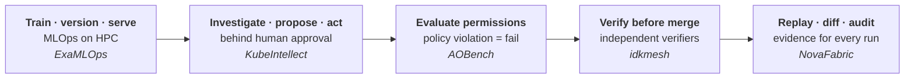

<picture>
  <source media="(prefers-color-scheme: dark)" srcset="assets/banner-dark.svg" />
  
</picture>

<h1 align="center">Mohsen Seyedkazemi Ardebili</h1>

  <b>AI Platform &amp; Agentic Systems Engineer · Independent Consultant</b> 
  Agentic AI · AI Platforms · MLOps/LLMOps · AI SRE &amp; AIOps · Kubernetes/OpenShift · HPC

  
  
  
  

I build **autonomous AI that acts on infrastructure — with a human at the gate.**

I design and operate the platforms that let AI agents and ML models run in production without anyone
losing control of them: approval gates, scoped RBAC, model registries, replay and audit trails.
I came to it the unusual way round — **six years running the IT and networks of a 1,000+ MW
combined-cycle power plant**, where there is no staging environment and a bad change measures in
megawatts, then a **PhD in high-performance computing**.

> [!NOTE]
> **Now:** Independent Consultant — AI Platform &amp; MLOps Engineer, with a current engagement for a
> European AI/HPC infrastructure client. Based in Italy · remote across Europe &amp; internationally ·
> **open to full-time roles, contracts and freelance engagements** → [mskazemi.com/hire](https://mskazemi.com/hire/)

---

## What I build: governed AI, from model to action

My five flagship projects each cover one stage of the same problem — putting AI into production
on real infrastructure **without giving up control**:

---

## Proof of work

### 🧠 [KubeIntellect](https://github.com/MSKazemi/kubeintellect) — an AI SRE for Kubernetes, human-governed

**My role:** creator and first author of the peer-reviewed paper.

|  |  |
|---|---|
| **Problem** | Diagnosing a live Kubernetes fault means correlating kubectl, Prometheus and Loki by hand under time pressure — and any tool that fixes it automatically is a tool nobody will run in production. |
| **What I built** | Ask the cluster a question in plain English. It gathers live evidence, works out the root cause, and **executes** the remediation — pausing for explicit human approval before it changes anything. |
| **Proof** | Peer-reviewed in the *Journal of Grid Computing* (2026), [10.1007/s10723-026-09837-6](https://doi.org/10.1007/s10723-026-09837-6) · [live demo](https://kubeintellect.com/demo) · `pip install kubeintellect` |

  

The shipping implementation is a LangGraph supervisor with PostgreSQL checkpoints that works from live
kubectl, Helm, Prometheus and Loki evidence and routes every mutating action through human approval.
The published architecture went further — a code-generator agent that wrote and validated new tools
at runtime; it was evaluated in the paper and deliberately dropped when the system was simplified
for production.

`Python` · `LangGraph` · `FastAPI` · `Kubernetes` · `PostgreSQL` · `Prometheus` · `Loki`

### 🏭 [ExaMLOps](https://github.com/MSKazemi/ExaMLOps) — production MLOps platform for HPC and supercomputers

**My role:** architect and lead developer.

|  |  |
|---|---|
| **Problem** | Sixteen partners on a EuroHPC consortium each needed to train, version, govern and serve models on a Tier-0 supercomputer — with no shared platform to do it on. |
| **What I built** | An end-to-end MLOps platform: a partner registers a model, the platform trains, versions, governs and serves it, behind a sysadmin approval gate. |

`Prefect` · `MLflow` · `Ray Serve` · `Slurm` · `FastAPI` · `React`

### 🛡️ [AOBench](https://github.com/MSKazemi/aobench) — evaluation and permission infrastructure for AI agents

**My role:** creator.

|  |  |
|---|---|
| **Problem** | Agent benchmarks score whether the answer looked correct. In operations, an agent that reaches the right answer by exceeding its permissions has failed. |
| **What I built** | A role-aware, permission-enforced benchmark for LLM agents doing real HPC operations work: a policy violation hard-fails the task, however correct the output. |
| **Proof** | 88 tasks across 10 categories × 5 roles · [archived with a DOI](https://doi.org/10.5281/zenodo.21854863) · paper under review. |

`Python` · `MCP` · `Slurm` · `RBAC`

### ✅ [idkmesh](https://github.com/MSKazemi/idkmesh) — verification infrastructure for AI agents

**My role:** creator and maintainer.

|  |  |
|---|---|
| **Problem** | Teams gate AI-agent work behind review panels — LLM judges, CI checks, human reviewers — and count every vote as independent. When their errors are correlated, a panel can be worth far fewer votes than it has members, and bad changes pass. |
| **What I built** | An open-source toolkit for AI-agent verification: a worker's self-report never counts as acceptance, independent verifiers check every result against versioned task contracts with bound provenance, and `idkmesh gate-audit` measures how many independent votes a review panel is really worth and audits review gates for correlated errors — with reproducible evidence for every accept/reject. |
| **Proof** | Apache-2.0 · installable `idkmesh` CLI · every claim tracked in a CI-validated [Capability Truth Matrix](https://github.com/MSKazemi/idkmesh/blob/main/docs/CAPABILITY_MATRIX.md) · built in the open, [good first issues tagged](https://github.com/MSKazemi/idkmesh/issues?q=is%3Aissue+state%3Aopen+label%3A%22good+first+issue%22) |

`Python` · `MCP` · `A2A` · `LLM-as-a-judge` · `GitHub Actions`

---

## Open-source products

| Project | What it does | Evidence | Stack |
|---|---|---|---|
| **[NovaFabric](https://github.com/MSKazemi/novafabric)** | Open-source, self-hosted replay and evidence infrastructure for AI agents and agentic systems — captures agent executions as portable Run Capsules for replay, behavioral/structural diff, lineage, cryptographic provenance, assurance and audit. | Apache-2.0 · beta · [novafabric.ai](https://novafabric.ai) | Python, OpenTelemetry, Kubernetes, SLURM |
| **[YazSes](https://github.com/MSKazemi/yazses)** | Offline-by-default voice dictation — nothing leaves your machine by default. Hold a key, speak, release — speech-to-text runs on your own CPU and the words are typed into whatever window has focus. **Works on Wayland**, where most dictation tools silently fail. | Apache-2.0 · cross-platform · built in the open by outside contributors, [good first issues tagged](https://github.com/MSKazemi/yazses/issues?q=is%3Aopen+label%3A%22good+first+issue%22) · [measured accuracy, published method](https://mskazemi.com/yazses/benchmarks.html) | Python, faster-whisper, Linux/macOS/Windows |
| **[kube-q](https://github.com/MSKazemi/kubeintellect/tree/main/v4/packages/kube-q)** | CLI and Python SDK for KubeIntellect — `pip install kube-q` | Streaming responses, Rich TUI · AGPL-3.0 | Python |

## Research systems — ML on real supercomputer telemetry

| Project | What it does | Evidence |
|---|---|---|
| **[GRAAFE](https://github.com/MSKazemi/GRAAFE)** | Graph neural network that anticipates compute-node anomalies on exascale HPC — trained offline, served online through a Kubeflow pipeline on live telemetry. | Published, *FGCS* 2024 · CINECA Marconi100 |
| **[HazardNet](https://github.com/MSKazemi/HazardNet)** | Thermal-hazard prediction for datacenters, over a year of telemetry from 3,312 nodes of CINECA's Marconi A2. Six-hour horizon, chosen with the facility manager. | Published, *FGCS* 2024 · [1 GB dataset on Zenodo](https://doi.org/10.5281/zenodo.10050368), CC BY 4.0 |

<b>More open-source work</b> — MCP, RAG, Slurm, Kubernetes and HPC tooling

 

| Repository | What it is |
|---|---|
| [mcp-zenodo](https://github.com/MSKazemi/mcp-zenodo) | Zenodo MCP server — tool-based LLM integration with the Zenodo open-access research repository via the Model Context Protocol. |
| [AI4HPC](https://github.com/MSKazemi/AI4HPC) | LLM + RAG system for querying HPC platform documentation and code — crawling, chunking, embeddings, vector search, LangChain retrieval. |
| [ai-agent-systems-course](https://github.com/MSKazemi/ai-agent-systems-course) | Hands-on course for building AI agent systems in Python: MCP, A2A, LangGraph/LangChain, multi-agent orchestration with Ollama. |
| [EnergetiScope](https://github.com/MSKazemi/EnergetiScope) | Predicts the energy consumption of Kubernetes workloads from their specs, before they run — ground-truth labels from Kepler (eBPF) via Prometheus. |
| [m100-silicon-binning](https://github.com/MSKazemi/m100-silicon-binning) | Recovers per-die CPU core-harvest maps from out-of-band BMC telemetry — 1,962 POWER9 sockets, reproducible from public M100 ExaData. |
| [SLURM_Simulator](https://github.com/MSKazemi/SLURM_Simulator) | Automated multi-node Slurm cluster on Vagrant + VirtualBox for local HPC testing, with MUNGE auth and MySQL job accounting. |
| [Vagrant-Kubernetes-ROS2-Deployment](https://github.com/MSKazemi/Vagrant-Kubernetes-ROS2-Deployment) | ROS 2 nodes on a multi-node Kubernetes cluster provisioned with Vagrant, monitored with Prometheus and Grafana. |

---

## Tech stack

| Area | Tools |
|---|---|
| **Platform & infrastructure** | Kubernetes · OpenShift · Helm · Terraform · Docker · Linux · Azure |
| **Agentic AI & LLM** | LangGraph · MCP · A2A · RAG · vLLM · FastAPI |
| **MLOps & pipelines** | MLflow · Kubeflow · Prefect · Ray Serve · KServe |
| **HPC** | Slurm · MPI · OpenMP |
| **Observability** | Prometheus · Grafana · Loki · OpenTelemetry |
| **ML systems** | Python · PyTorch · GNNs · TCN/LSTM · anomaly detection · time-series telemetry at datacenter scale |

---

## Research

**PhD:** Design, Analysis, and Management of High-Performance Computing Systems · University of Bologna (2018–2022)

| Selected peer-reviewed work | Venue | Year |
|---|---|---|
| [KubeIntellect: A Modular LLM-Orchestrated Agent Framework for Kubernetes Management](https://doi.org/10.1007/s10723-026-09837-6) | *Journal of Grid Computing* | 2026 |
| [GRAAFE: GRaph Anomaly Anticipation Framework for Exascale HPC Systems](https://doi.org/10.1016/j.future.2024.06.032) | *FGCS* | 2024 |
| [M100 ExaData: A Data Collection Campaign on CINECA's Marconi100 Tier-0 Supercomputer](https://www.nature.com/articles/s41597-023-02174-3) | *Nature Scientific Data* | 2023 |

Three open datasets, 26 GB in total: [M100 ExaData](https://doi.org/10.5281/zenodo.7541722),
the [HazardNet thermal dataset](https://doi.org/10.5281/zenodo.10050368) (first author) and
[PM100](https://doi.org/10.5281/zenodo.10127767) — free to download, no registration.

<b>Reviewing and programme committees</b>

 

Reviewer for IEEE TCAD · FGCS · *Journal of Grid Computing* · SC · ACM CF · DATE · PDP · AsHES.
PC member: PDP 2025 · PDP 2026 · AsHES 2026.

[Full publication list and current citation counts → Google Scholar](https://scholar.google.com/citations?user=xP64pZsAAAAJ) · [ORCID](https://orcid.org/0000-0002-1166-6559) · [dblp](https://dblp.org/pid/282/6179)

---

## Work with me

<table>
<tr>
<td width="50%" valign="top">

### 💼 Hiring?

For **AI Platform · Agentic Systems · MLOps/LLMOps · Kubernetes/OpenShift** roles.
Based in Italy; available for remote roles across Europe and internationally, with
working-hour overlap by arrangement (Europe/Rome, CET/CEST).

**→ [LinkedIn](https://www.linkedin.com/in/mskazemi/)** · **[mohsen@mskazemi.com](mailto:mohsen@mskazemi.com)**

</td>
<td width="50%" valign="top">

### 🤝 Need a consultant?

Each engagement starts with a fixed-price audit, so you see the work before committing to a project:

- **Kubernetes reliability & AIOps** — health-checks, observability, hardening, incident root-cause analysis
- **MLOps & ML in production** — registry, serving, drift detection, governed retraining, monitoring
- **Production LLM agents** — tool boundaries, scoped RBAC, human-in-the-loop safety, tracing, audit trails

**→ [Engagements, rates and how it works](https://mskazemi.com/hire/)**

</td>
</tr>
</table>

---

  
    <a href="https://mskazemi.com/">Website</a> ·
    <a href="https://mskazemi.com/about/">About</a> ·
    <a href="https://www.linkedin.com/in/mskazemi/">LinkedIn</a> ·
    <a href="https://gitlab.com/mskazemi">GitLab</a> ·
    <a href="https://pypi.org/user/MSKazemi/">PyPI</a> ·
    <a href="https://mastodon.social/@mskazemi">Mastodon</a> ·
    <a href="https://scholar.google.com/citations?user=xP64pZsAAAAJ">Scholar</a> ·
    <a href="https://orcid.org/0000-0002-1166-6559">ORCID</a>
  

